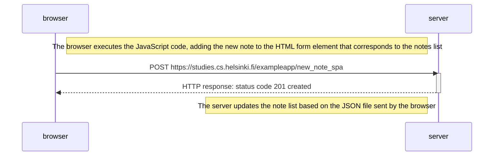

```mermaid
sequenceDiagram
    participant browser
    participant server

    Note right of browser: The browser executes the JavaScript code, adding the new note to the HTML form element that corresponds to the notes list

    browser->>server: POST https://studies.cs.helsinki.fi/exampleapp/new_note_spa
    activate server
    server-->>browser: HTTP response: status code 201 created
    deactivate server

    Note left of server: The server updates the note list based on the JSON file sent by the browser
```
